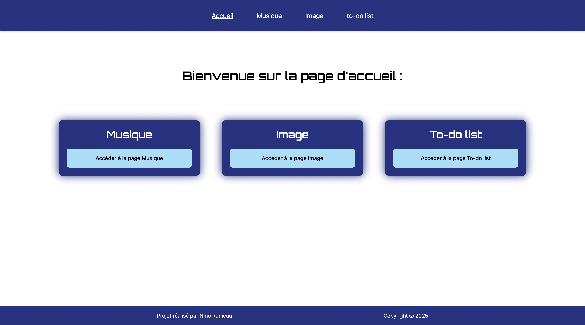

# Projet cours JavaScript

Ce projet est composé en plusieurs parties :
- une application de musique en JavaScript (réalisée en cours)
- une application de gestion d'images (réalisée en cours)
- une application de to-do list (réalisée en projet)

La to-do list est entièrement fonctionnelle (ajouter, supprimer, modifier, marquer comme complétée, compteur de tâches) en utilisant le local storage. L'application est stylisée avec Tailwind CSS et est entièrement responsive.

## Sommaire

1. [Technologies utilisées](#technologies-utilisées)
2. [Barème](#bareme)
3. [Déploiement](#déploiement)
4. [Aperçu](#aperçu)
5. [Auteur](#auteur)
6. [Licence](#licence)

## Technologies utilisées

- **HTML** : Structure de la page web
- **Tailwind CSS** : Mise en forme et styles
- **JavaScript** : Logique de l'application et interactions utilisateur

## Barème de la to-do list
### Fonctionnalité requise : /14
- Ajout de tâches (3 points) 
- Affichage des tâches (2 points) 
- Marquer comme complétée/incomplète (3 points) 
- Supprimer des tâches (2 points) 
- Compteur de tâches (2 points) 
- Édition de tâche (2 points) 

    ### BONUS :
    Fonctionnalités avancées (+1 à +3 points) 
    - Filtres (+2 pts) : Afficher toutes/complétées/incomplètes 
    - Réorganisation (+3 pts) : Drag & drop ou boutons up/down 

    #### Améliorations techniques (+1 point chacune) 
    - Validation robuste : Prévention des doublons, trim des espaces 
    - Animations/transitions : Effets visuels lors d'ajout/suppression 
    - Raccourcis clavier : Touches pour actions rapides 
    - Responsive design : Fonctionne sur mobile

### Qualité d'implémentation technique : /4 
-  Utilisation correcte des concepts vus en cours (2 points) 
- Gestion des données et persistance (local storage) (2 points)

### Ergonomie - UI/UX : /2 

## Déploiement

L'intégration est visible sur : [visible](lien).

## Aperçu

## Auteur

**Nino Rameau** - [Portfolio](https://nino-rameau.fr) - [LinkedIn](https://www.linkedin.com/in/nino-rameau-1a0636332/) - [GitHub](https://github.com/Nino-Rameau)

## Licence

Réalisé dans le cadre scolaire en novembre 2025.